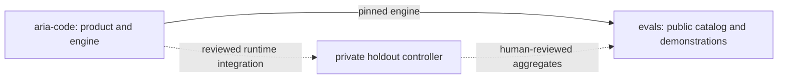

# Repository collaboration

The three repositories separate the agent runtime, public evaluation materials, and confidential holdout evaluation.

| Repository | Owns | Uses |
| --- | --- | --- |
| [`artheras/aria-code`](https://github.com/artheras/aria-code) | The product, agent runtime, evaluation engine, unit tests, and product regression tests | Public evaluation feedback to improve the product |
| [`artheras/evals`](https://github.com/artheras/evals) | Original public tasks, catalog versions, grader calibration, runner identity checks, and aggregate reporting | An immutable Aria Code engine revision |
| `artheras/aria-evals-holdout` — private | Confidential tasks, reference answers, trusted grading controls, and internal evaluation records | Reviewed runtime revisions and an independently maintained private task bank |

The solid dependency is implemented by this catalog. Dashed connections describe planned integration; cross-repository orchestration and private aggregate publication are not connected by this initial release.

## Current workflow

The public catalog installs a pinned Aria Code engine and calls its official evaluation runner. The catalog wrapper validates the suite, records provenance and settings, and constructs an aggregate summary from an allowlist of fields. It does not maintain a second agent loop.

Public CI validates the catalog, calibrates the graders with correct and incorrect solutions, and exercises the model-free preflight. It uses no model secrets and makes no model calls. Contributors can reproduce these checks before opening a pull request.

The private bank stays in its existing private repository. This public repository does not fetch it, depend on access tokens for it, or include its files, Git history, examples, answers, or raw run logs. An agent's ability to access a grader on the host cannot be treated as a secrecy boundary. Holdout execution must retain the private controller's trusted grading and isolation controls.

## Proposed release flow

1. Develop runtime changes and product regressions in `aria-code`. Keep tests that belong to product behavior there.
2. Select an immutable engine revision for this catalog. Update the registry pin and validate installation identity, positive and negative grader calibration, and the model-free preflight.
3. Run public model evaluations explicitly in a trusted environment. Record the catalog digest and revision, engine revision, provider and model, repetition count, timeout, run kind, and all outcome counts.
4. In the private repository, independently select and review the runtime revision before running the confidential suite. A public pull request must not receive private credentials or private grader files.
5. A maintainer reviews private results locally and decides whether to release an aggregate. The export must omit prompts, answers, grader content, per-task identifiers, transcripts, file diffs, and raw logs. Preserve methodology and outcome counts so errors and invalid trials remain visible.

Model-running automation, when added, should require an explicit trusted trigger and configured credentials. Public pull requests should continue to run offline checks only. A private controller can consume public runtime artifacts; a public job should not pull the private bank.

## Where existing evaluations belong

Keep Aria Code's unit tests and implementation regressions with the product. Public reusable benchmark tasks may move into this catalog through a reviewed contribution with provenance, licensing, versioning, and grader calibration. Maintain one source of truth for each migrated task and update callers deliberately.

Already published evaluations remain public evaluations after a move. They cannot become fresh holdout evidence by moving to a private repository, renaming them, or changing their formatting. Create and maintain confidential tasks independently, track any exposure or use during tuning, and retire compromised holdout material internally.

The three demonstration tasks in this initial catalog were authored for this repository. They were not extracted from the private bank.

## Interpreting results

Compare results only after checking compatible task and grader versions, runtime revisions, model settings, and repetition counts. Record `invalid` and `error` outcomes alongside `pass` and `fail`; a high rate over scored trials can otherwise conceal missing or broken trials.

Public demo performance describes these public tasks. It is not evidence of unseen-task generalization. Offline calibration proves grader behavior for its checks and produces no model score. Missing usage or cost information stays `null`.

Private aggregate exports need a separate review and approved publication destination. Generating a summary file does not itself authorize publishing it.
